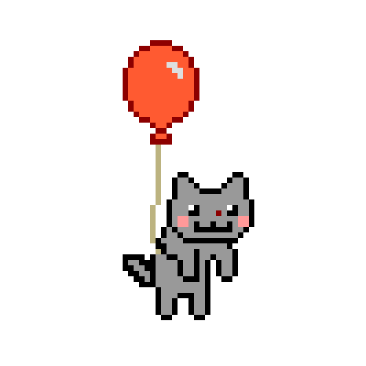

# 👋 Hey there, welcome to my GitHub!  

  

---

## 🚀 About Me  

Hi! I'm **AutoCookies**  
🎓 A student who loves building, breaking, and re-creating things.  
🌱 Always curious about how stuff works under the hood.  
💡 My motto: **_"Be a creator, not a person just know to use existing solutions."_**

Although I'm still early in my career, I believe **creativity > experience**.  
Every repo here is a piece of my journey — some are projects, some are experiments, some are just for fun!  

---

## 🛠 Tech Stack  

  
  
  
  
  

---

## 📚 What You’ll Find Here  

🔹 **Study Projects** – assignments, learning exercises, and explorations.  
🔹 **Fun Experiments** – random ideas turned into code.  
🔹 **Open-source Love** – small contributions & attempts to give back.  

---

## 🎯 Vision  

> "I don’t just want to **use** solutions.  
> I want to **create** them."  

💻 I dream of turning ideas into real products.  
✨ One repo at a time, I'm shaping my skills.  

---

## 🎲 Fun Facts  

- 🐱 Cat lover & coffee addict.  
- 🎮 Love playing strategy games in free time.  
- 🛠 Always tinkering with random side-projects.  

---

## 🏅 My Certifications  

  
  
  

  🎓 Verified certifications from <b>HackerRank</b> & <b>Coursera</b>  

---

## 🎥 My Channel & Videos  

  
  
  

---

## 🔗 Connect with Me  

  
  

---

  ⭐️ If you like my work, consider giving it a star. Let’s build something amazing together!

