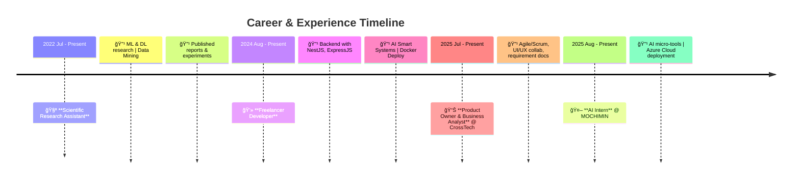

# 👋 Welcome to AutoCookies' GitHub  

  

  

---

## 🚀 About Me  

🎓 A passionate **student & builder** who loves creating products, breaking limits, and re-imagining solutions.  
🌱 Curious about **AI, System Design, and Product Development**.  
💡 Motto: *"Be a creator, not just a user."*  

✨ Every repo is a story — some are serious projects, others are experiments, but all reflect my growth journey.  

  
  

---

## 🛠 Tech Stack  

  <!-- Languages -->
  
  
  
  
  
  <!-- Frameworks -->
  
  
  
  
  
  <!-- Databases -->
  
  
  

  <!-- DevOps -->
  
  

  <!-- AI/ML -->
  
  
  
  <!-- Business -->
  
  

---

## 🛤 My Journey Roadmap  

  

## 🏅 My Certifications  

  
  
  
  
  

  

  🎓 Verified certifications from <b>HackerRank</b>, <b>Coursera</b> & <b>LinkedIn Learning</b>  

---

## 🎥 My Channel & Videos  

  
  
  

---

## 🔗 Connect with Me  

  
  
  
  
  

---

  ⭐️ If you like my work, consider giving it a star. Let’s build something amazing together!

